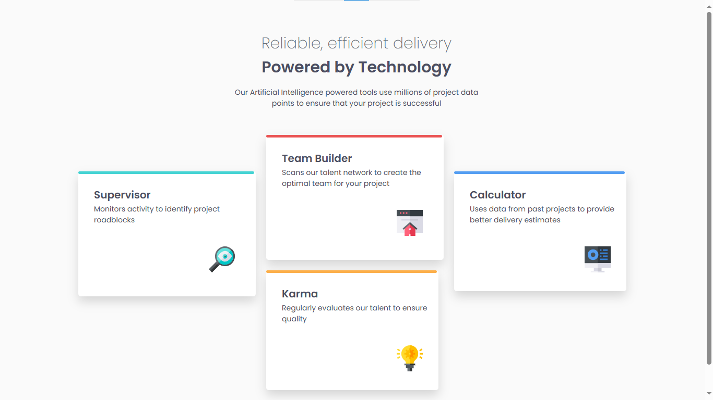

# Frontend Mentor - Four card feature section solution
This is a solution to the [Four card feature section challenge on Frontend Mentor](https://www.frontendmentor.io/challenges/four-card-feature-section-weK1eFYK). Frontend Mentor challenges help you improve your coding skills by building realistic projects. 

### The challenge

Users should be able to:

- View the optimal layout for the site depending on their device's screen size

## Overview
This project is a responsive Four Card Feature Section built based on a Frontend Mentor challenge. It showcases a modern layout with a central heading and four feature cards, each styled with unique colors and icons. The goal was to practice layout skills using Flexbox, box-shadow, and semantic HTML/CSS while maintaining pixel-perfect design accuracy.

## Features 
- Responsive Layout: Adapts beautifully across screen sizes using Flexbox and relative units.
- Custom Card Design: Each card includes a color-coded top border and consistent shadow for depth.
- Google Fonts Integration: Utilizes the sleek and readable Poppins font with multiple weights.
- Clean & Semantic HTML: Organized structure for easy reading, accessibility, and scalability.

### Screenshot

### Live Site Url
https://echo-script0.github.io/Four-card-feature-section/

### Built with
- HTML5 – For semantic structure
- CSS3 – For layout, styling, and responsiveness
- Google Fonts (Poppins) – For typography

## Author
- Aisha Adeyemo
- Frontend Mentor - (https://www.frontendmentor.io/profile/echo-script0)